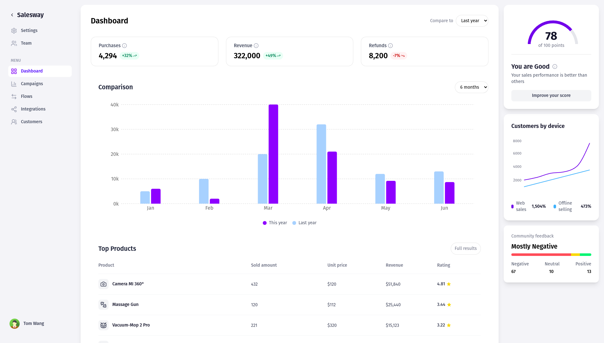

Here’s the updated README with the dashboard image at the start:

---

# Project Setup Instructions



Follow the steps below to get the project up and running.

## 1. Clone the repository

```bash
git clone https://github.com/RohithAchar/CerebralZip-assignment.git
cd CerebralZip-assignment
```

## 2. Backend Setup

1. Navigate to the `backend` directory:

   ```bash
   cd backend
   ```

2. Install dependencies:

   ```bash
   npm install
   ```

3. Start the MySQL database (Ensure MySQL is installed and running).

4. Seed the database:

   ```bash
   npm run seed
   ```

5. Start the backend server:
   ```bash
   npm run start
   ```

## 3. Frontend Setup

1. Navigate to the `frontend` directory:

   ```bash
   cd ../frontend
   ```

2. Start the development server:
   ```bash
   npm run dev
   ```

Your application should now be running!

---

Make sure to replace `path/to/your/dashboard-image.png` with the actual relative path to your dashboard image in the project.
